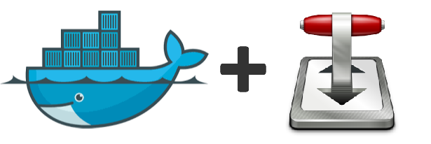

Transmission Bittorrent Client - Docker Image (Multiarch)
===

[](https://hub.docker.com/r/jaymoulin/transmission/)
[](https://hub.docker.com/r/jaymoulin/transmission/)
[](https://www.paypal.me/jaymoulin)
[](https://www.buymeacoffee.com/jaymoulin)
[](https://www.ko-fi.com/jaymoulin)

DISCLAIMER: As-of 2021, this product does not have a free support team anymore. If you want this product to be maintained, please support on Patreon.

(This product is available under a free and permissive license, but needs financial support to sustain its continued improvements. In addition to maintenance and stability there are many desirable features yet to be added.)

THIS REPOSITORY IS AUTO-UPDATED BY [GITHUB-RELEASE-NOTIFIER](https://github.com/femtopixel/github-release-notifier) (https://github.com/femtopixel/github-release-notifier)

This image allows you to run an headless Bittorrent client on your machine easily thanks to Docker.

Installation
---

This will start Transmission
```
docker run -d --restart=always --name transmission -u $(id -u) -v /path/to/incoming/torrents:/to_download -v /path/to/downloaded/files:/output -p 9091:80 -p 51413:51413 -p 51413:51413/udp -e PORT=80 jaymoulin/transmission
```

### Credentials

Configure your credentials with `docker exec transmission configure <username> <password>` command. The container will restart and your credentials will be applied.
Default credentials are empty (no username, no password).

### Volumes

* Mount a volume to `/to_download` folder so you can put .torrent files in to be downloaded
* Mount a volume to `/output` folder to retrieve your downloaded files

### Ports

* 9091 is the port for web interface. You can go to http://__machine_ip__:9091 to display interface
* 51413 and 51413/udp are the port for torrents

### Variables

* You can also change the `PORT` variable for web interface. Default is set to 9091 but you can define whetever you want

### Advanded users

You can set your own options by overriding `CMD`.

Default:

```
CMD my-daemon
```

Your own options:

```
 CMD my-daemon -c /to_download -w /output -f -T -b http://john.bitsurge.net/public/biglist.p2p.gz --no-incomplete-dir -O -Y --utp -M -ep -g /config
```

In docker-compose, you may have a configuration like this:

```
version: "3.7"
services:
    transmission:
        image: jaymoulin/transmission
        restart: unless-stopped
        command: my-daemon -c /to_download -w /output -T -b --no-incomplete-dir -O -Y --utp -M -ep -f -g /config
        ports:
            - 9091:9091
            - 51413:51413
        volumes:
            - /data/transmission/to_download:/to_download
            - /data/transmission/output:/output
            - /data/transmission/config:/config
```

Updating
---

When Transmission new version is released, you will be able to update your running version with this command:
 
```
docker exec transmission apk upgrade --update --no-cache transmission-daemon && docker restart transmission
```

Appendixes
---

### Install Docker

If you don't have Docker installed yet, you can do it easily in one line using this command
 
```
curl -sSL "https://gist.githubusercontent.com/jaymoulin/e749a189511cd965f45919f2f99e45f3/raw/0e650b38fde684c4ac534b254099d6d5543375f1/ARM%2520(Raspberry%2520PI)%2520Docker%2520Install" | sudo sh && sudo usermod -aG docker $USER
```

